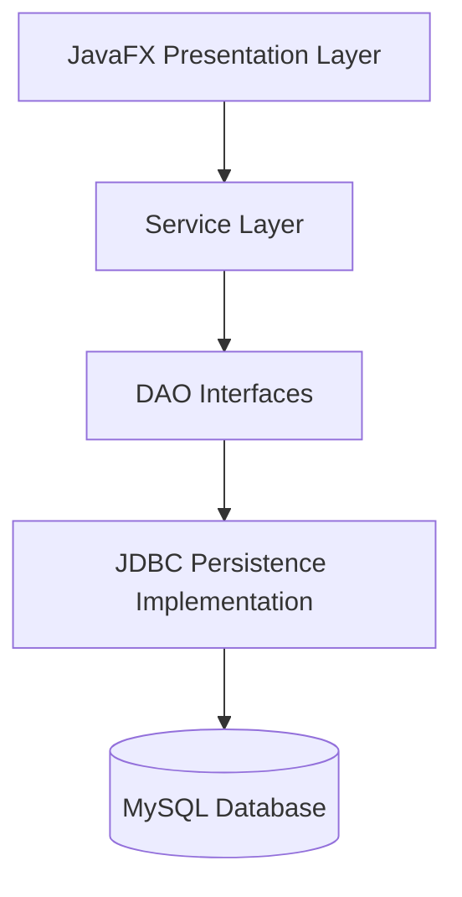

# ArtConnect Pro - Local Art Community Platform

## Overview
ArtConnect Pro is a JavaFX application for managing an art community with persistent MySQL storage. It covers artists, artworks, galleries, exhibitions, workshops, community members, and registrations.

The current codebase uses a layered architecture:
1. JavaFX controllers and FXML views for the UI.
2. Service classes for business logic.
3. JDBC DAO implementations for persistence.
4. MySQL as the backing database.

## Current Features
- Artists CRUD with searchable list.
- Artworks CRUD with artist selection.
- Galleries CRUD with validation on rating.
- Exhibitions CRUD with gallery selection.
- Workshops CRUD with instructor selection.
- Community members CRUD.
- Dedicated registrations tab for enrolling members in workshops and exhibitions.
- Dropdown lists refresh from the database after create, update, and delete operations.

## Project Structure
- `com.project.artconnect.model`: Domain entities.
- `com.project.artconnect.dao`: DAO interfaces.
- `com.project.artconnect.persistence`: JDBC DAO implementations.
- `com.project.artconnect.service`: Business services.
- `com.project.artconnect.service.impl.jdbc`: JDBC service implementations.
- `com.project.artconnect.ui`: JavaFX controllers.
- `com.project.artconnect.util`: Shared helpers such as `ConnectionManager` and `ServiceProvider`.

## Requirements
- Java 17+
- Maven
- MySQL running locally

## Configuration
Edit `src/main/java/com/project/artconnect/config/DatabaseConfig.java` if your MySQL host, database name, user, or password are different.

## How to Run
```bash
mvn clean compile
mvn javafx:run
```

## Database Setup
1. Create the `artconnect` database.
2. Run the SQL scripts in the project root to create tables, triggers, procedures, views, and test data.
3. Verify the credentials in `DatabaseConfig.java`.

## Notes
- Some of the project files still contain temporary implementation notes while the livrable documentation is being finalized.
- The application has been verified to compile and start successfully.

## Architecture Diagram

